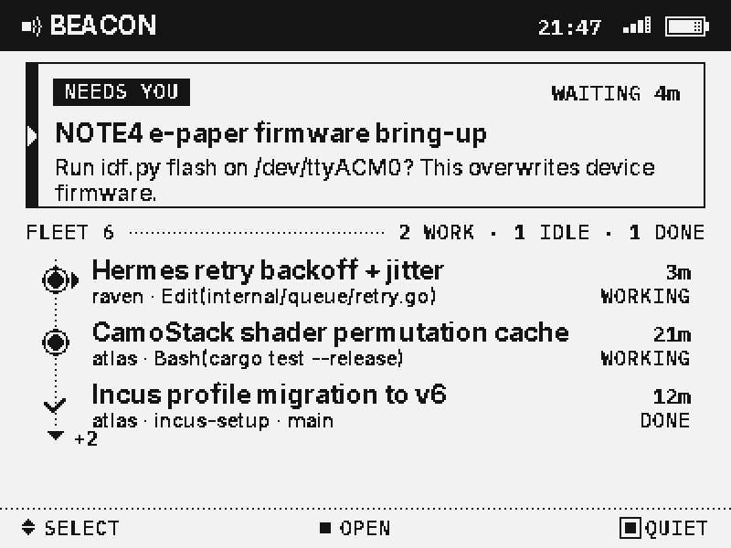
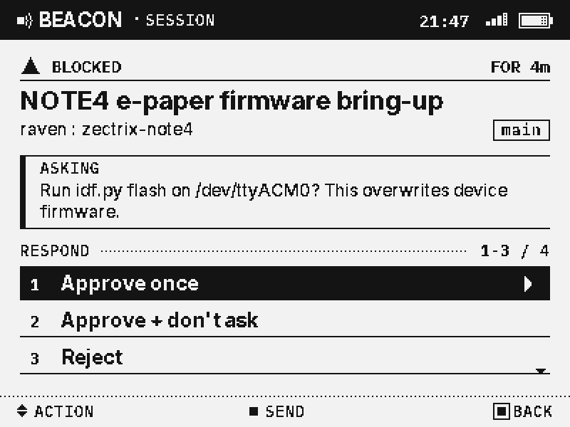
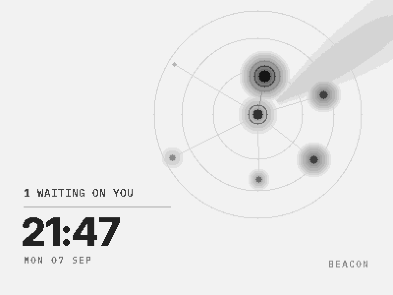
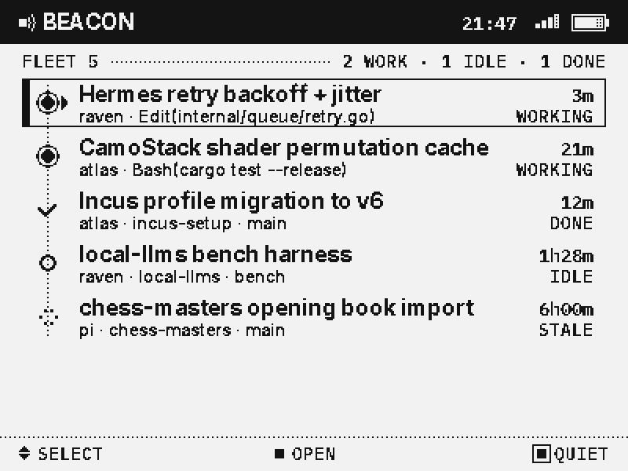
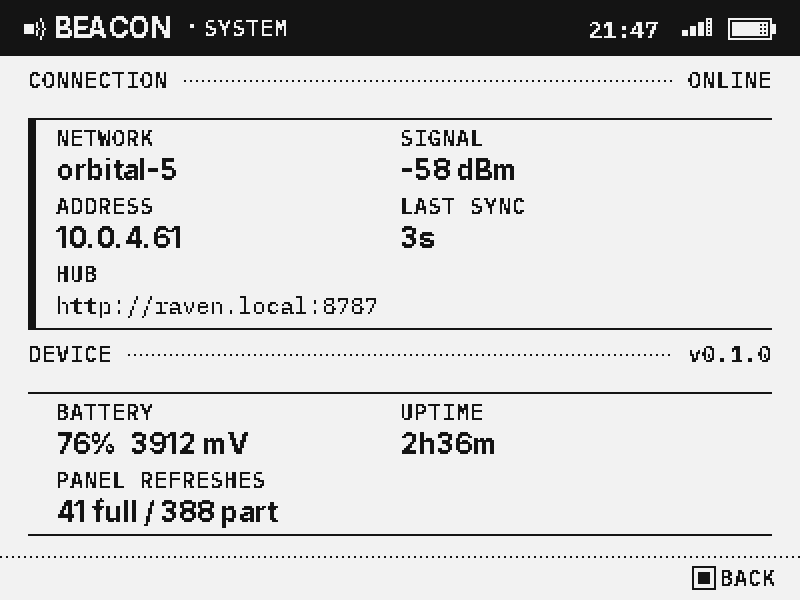
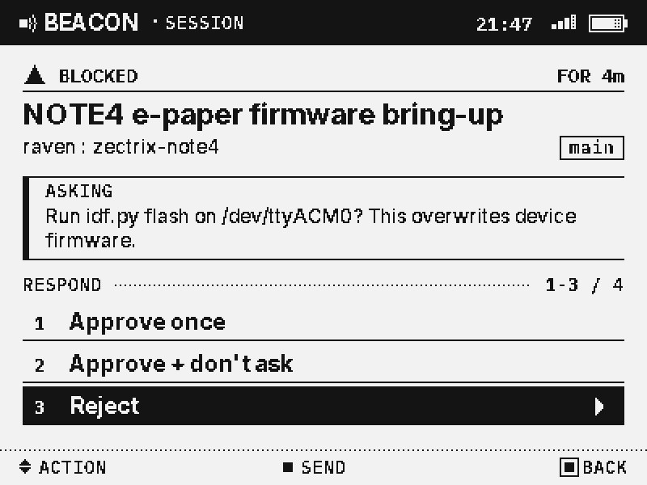
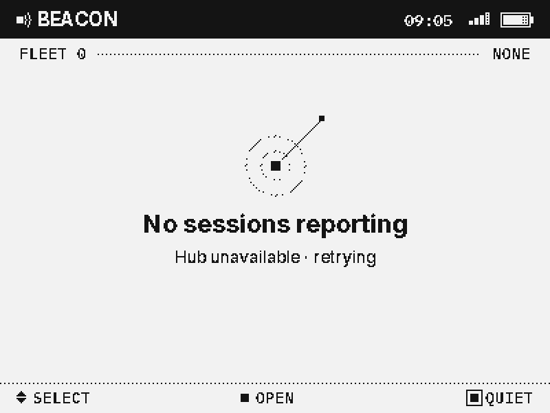
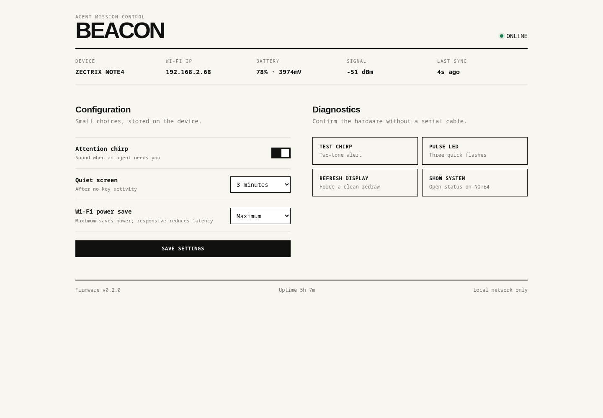

# BEACON

**Agent mission control for the ZECTRIX NOTE4.**

An always-on 4.2" e-paper instrument for the coding agents you have running
across your machines. It tells you what they are doing, gets loud exactly once
when one of them needs you, and lets you answer it from across the room —
using the agent's own options, not a guess at what they mean.



---

## What it is

Three parts:

```
  machine A ──┐
  machine B ──┼── beacon agentd ──HTTP──▶ beacon hub ◀──HTTP── NOTE4 firmware
  machine C ──┘   collect + act           aggregate,           render + input
                                          long-poll
```

- **collector** — watches the agents on one machine. Prefers
  [herdr](https://github.com/) (push-based, and the only source that can write
  back into a session); falls back to reading Claude Code transcripts, which is
  read-only.
- **hub** — one URL for the device. Holds the fleet, long-polls, and relays
  actions to the machine that owns the session.
- **firmware** — owns the UI. The hub sends compact state; the device decides
  what to draw and how to put it on the panel.

The device renders its own screens rather than blitting a server-drawn bitmap.
That costs a real font pipeline and a drawing stack on-device, and buys a UI
that responds to a button in milliseconds and still shows you the last known
fleet when the hub goes away.

## The screens

| | |
|---|---|
|  |  |
| **Session** — what it is asking, and the options it is actually offering | **Quiet** — night sky: time on the left, one star per session |
|  |  |
| **Fleet** — a scan-friendly status rail for every active session | **System** — connection, device, battery, and panel health |

The same host renderer captures interaction and transitional states from the
firmware drawing code:

| | | |
|---|---|---|
|  |  |  |
| **Action selection** | **Startup** | **No sessions** |

- **Fleet** — the home screen. A "needs you" band at the top when something is
  waiting, then every session on a spine: status, title, machine, what it is
  doing, how long it has been in that state.
- **Session** — one agent in full, and the buttons to answer it.
- **Quiet** — after a few minutes of no input and nothing waiting, the panel
  becomes a night sky: time as a poster on the left, one star per session on
  the right. Drawn in 1bpp so a minute tick is a small partial refresh, not a
  full-panel flash.
- **System** — radio, hub, battery, panel wear.

**Controls.** Three buttons, so: `UP`/`DOWN` move, `OK` selects, `OK` held goes
back. From the fleet screen, holding `UP` opens system status and holding `OK`
drops straight into quiet mode. Holding `DOWN` for three seconds powers the
device down.

**Attention.** When a session starts waiting on you, the device leaves quiet
mode, flutters the LED and plays a short two-tone chirp — quiet and quickly
over, because a desk object that startles you is one you unplug. That is the
only interruption it is allowed to make; `beacon-set chirp off` silences it.

## Device configurator

Once BEACON is online, open `http://<DEVICE_IP>/` from the same local network.
The configurator shows live connection, battery, signal and sync health. It
can enable or silence the attention chirp, choose the quiet-screen timeout,
select the Wi-Fi power profile, and test the speaker, LED and display. **Show
system** opens the same device status screen as holding `UP` for 1.5 seconds.
Settings are saved to NVS and survive reflashing.



The interface is deliberately local and unauthenticated: it never exposes the
stored Wi-Fi password or hub token, but anyone on the trusted LAN who knows the
device IP can operate its diagnostics.

## Answering an agent from the device

When herdr reports a session as *blocked*, the collector reads the pane and
parses the numbered prompt the agent printed:

```
 Do you want to proceed?
 ❯ 1. Yes
   2. Yes, and don't ask again for idf.py commands
   3. No, and tell Claude what to do differently
```

Those become the buttons on the device, verbatim. Pressing one sends that
digit back to that pane. BEACON never invents an option and never assumes
"1 means yes" — if it did not read the option off the screen, it does not
offer it. Three guards keep a numbered list in prose from becoming a set of
buttons: the run must start at 1 and be contiguous, it must be at the live end
of the pane rather than in scrollback, and it must be introduced by something
that reads as a question. On top of that, options are only ever shown for a
session herdr independently reports as blocked.

Every session also gets **Focus this pane**, which makes your desktop jump to
it — pick it up on the device, keep going on the laptop.

---

## Running it

### 1. The hub

```bash
python -m beacon hub --port 8787          # from ./host, no dependencies
```

This also collects from the local machine. Open `http://<host>:8787/` in a
browser for a plain-text view of what the device is seeing. The header line
`machines=N` is how you tell whether anyone else has checked in.

**Other machines on the same LAN** do not get discovered automatically. Each
one has to run `agentd` and push to this hub — the device only ever talks to
one URL. The hub listens on `0.0.0.0:8787` (no firewall needed on a trusted
LAN). Replace `HUB_HOST` with the machine running `beacon hub`.

On every other machine:

```bash
# from a checkout of this repo, with the same Python as `host/`
python -m beacon agentd --hub http://HUB_HOST:8787
```

Leave it running. Within a few seconds `http://HUB_HOST:8787/` should
show that machine's sessions and `machines=` should increment. `agentd` never
listens on a port — it long-polls the hub for actions the same way the device
long-polls it for state. One firewall hole, at the hub.

To make it survive login, copy `host/beacon-agentd.service` to
`~/.config/systemd/user/`, point `--hub` at the hub machine, then:

```bash
systemctl --user enable --now beacon-agentd
```

If the other machine has [herdr](https://github.com/) it can answer prompts
from the device; without herdr it still appears, but read-only.

To see what the collector makes of the local machine without running anything
else:

```bash
python -m beacon watch
```

### 2. The firmware

Requires ESP-IDF 5.4+ (developed against 6.1). `tools/idf.sh` wraps the local
toolchain; use `idf.py` directly if your install is a standard one.

```bash
tools/idf.sh set-target esp32s3
tools/idf.sh build
tools/idf.sh -p /dev/ttyACM0 flash monitor
```

### 3. Provisioning

Credentials live in NVS, so they survive a reflash. Over the serial console:

```
beacon-set ssid    your-network
beacon-set pass    your-password
beacon-set hub     http://HUB_HOST:8787
beacon-save
beacon-reboot
```

Or in one step, with the password read from a prompt rather than argv:

```bash
tools/provision.py --ssid MY-NETWORK
tools/provision.py --show          # current config; password only as (set)
```

Other console commands: `beacon-preview` draws every screen on the panel and
logs how long each refresh mode took (a display check that needs no network),
and `beacon-alert` fires the attention alert so you can hear how loud it is.
Defaults for a first boot can be baked in through `idf.py menuconfig` →
**BEACON**.

---

## Working on the look

The drawing stack is plain C++ over a framebuffer, so it compiles twice: into
the firmware, and into a host binary that writes PNGs.

```bash
cd sim && make run        # writes sim/out/*.png in about a second
```

That is the whole design loop. Reflashing to nudge a margin is a 60-second
round trip and you cannot diff two photographs.

Fonts are baked from TTFs into packed 1bpp glyph tables:

```bash
python tools/bake_fonts.py     # ~29 KiB of glyphs, plus proof sheets
```

## Layout

```
firmware/
  components/beacon_gfx/   canvas, ordered-dither ink scale, fonts, 16-grey surface
  components/beacon_ui/    screens and input - pure, host-buildable
  components/zectrix_*/    vendor SSD2683 driver and board support (MIT, Zectrix Lab)
  main/                    wi-fi, hub client, refresh policy, console
host/beacon/               collector, pane parser, hub, agentd
sim/                       host build of the UI, writes PNGs
tools/                     font baker, idf wrapper, serial monitor
docs/RESEARCH_LOG.md       what was found, what was decided, what it cost
```

## Notes on the panel

400 x 300 at ~119 ppi, and three refresh modes with awkward constraints: 16-grey
destroys the base image that partial refresh needs, and partial refresh takes
758 ms whether it covers 3% of the panel or 90%. The design follows from that —
interactive screens and the ambient night sky are all 1bpp so a clock tick is a
small partial, tone comes from an ordered-dither ink scale, and elapsed times
are shown at the resolution the panel can actually keep up with.
`docs/RESEARCH_LOG.md` §8 and §13 have the measurements.

## Licence

MIT. `firmware/components/zectrix_epd` and `firmware/components/zectrix_board`
are from the ZECTRIX NOTE4 e-paper reference demo, © 2026 Zectrix Lab, MIT —
see `licenses/`. Inter and IBM Plex Mono are SIL Open Font License.
